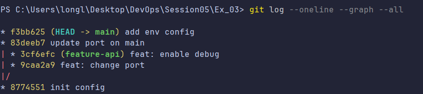
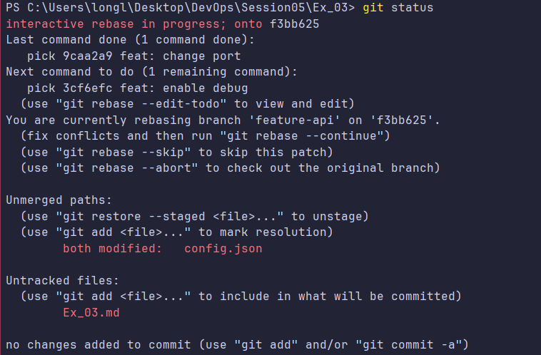
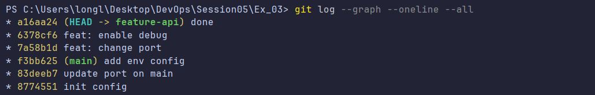

# Bài 3: Xử lý xung đột phức tạp trong quá trình Rebase

## 1. Mục tiêu

- Hiểu cách xử lý xung đột (conflict) trong quá trình Rebase.
- Thực hiện giải quyết conflict thủ công ở từng commit.
- Đưa các commit của nhánh `feature-api` lên trên các commit mới nhất của nhánh `main`.
- Giữ lịch sử commit tuyến tính, không tạo merge commit.

---

## 2. Chuẩn bị repository

Khởi tạo repository và tạo file `config.json` trên nhánh `main`:

```json
{
  "port": 8080,
  "debug": false
}
```

Thực hiện commit khởi tạo:

```bash
git add config.json
git commit -m "init config"
```

Tạo và chuyển sang nhánh tính năng mới:

```bash
git checkout -b feature-api
```

---

## 3. Các commit trên nhánh `feature-api`

### Commit 1: Thay đổi port
Cập nhật file `config.json`:

```json
{
  "port": 9000,
  "debug": false
}
```

Commit thay đổi:

```bash
git add config.json
git commit -m "feat: change port"
```

### Commit 2: Bật debug
Tiếp tục sửa file `config.json`:

```json
{
  "port": 9000,
  "debug": true
}
```

Commit thay đổi:

```bash
git add config.json
git commit -m "feat: enable debug"
```

---

## 4. Các commit mới trên nhánh `main`

Quay trở lại nhánh `main`:

```bash
git checkout main
```

### Thay đổi port thành 8081:

```json
{
  "port": 8081,
  "debug": false
}
```

Commit thay đổi:

```bash
git add config.json
git commit -m "update port on main"
```

### Bổ sung môi trường production:

Cập nhật `config.json`:

```json
{
  "port": 8081,
  "debug": false,
  "env": "production"
}
```

Commit thay đổi:

```bash
git add config.json
git commit -m "add env config"
```


---

## 5. Thực hiện Rebase

Chuyển về nhánh `feature-api`:

```bash
git checkout feature-api
```

Thực hiện rebase nhánh `feature-api` lên trên `main`:

```bash
git rebase main
```

> *Lưu ý:* Quá trình rebase sẽ tạm dừng do phát sinh conflict tại file `config.json`.

---

## 6. Xử lý Conflict lần 1

Conflict xảy ra khi Git cố gắng áp dụng commit: `feat: change port`.

**Nguyên nhân:** Nhánh `main` đã sửa giá trị `"port": 8081`, trong khi commit trên nhánh `feature-api` lại đổi thành `"port": 9000`.

Kiểm tra trạng thái xung đột:

```bash
git status
```

Mở file `config.json` để giải quyết thủ công. Giữ giá trị `port` từ nhánh `feature-api` (`9000`) và giữ thêm cấu hình `env` từ nhánh `main`.

**Nội dung sau khi giải quyết:**

```json
{
  "port": 9000,
  "debug": false,
  "env": "production"
}
```

Đánh dấu conflict đã giải quyết và tiếp tục rebase:

```bash
git add config.json
git rebase --continue
```



---

## 7. Xử lý Conflict lần 2

Sau khi commit đầu tiên được áp dụng thành công, Git tiếp tục áp dụng commit: `feat: enable debug` và gặp conflict tiếp theo trên `config.json`.

Kiểm tra trạng thái:

```bash
git status
```

Mở file `config.json` và giải quyết conflict thủ công bằng cách kết hợp:
- `port: 9000` (giữ từ nhánh `feature-api`).
- `debug: true` (từ commit `feat: enable debug`).
- `env: "production"` (từ nhánh `main`).

**Nội dung sau khi giải quyết:**

```json
{
  "port": 9000,
  "debug": true,
  "env": "production"
}
```

Đánh dấu hoàn thành và tiếp tục:

```bash
git add config.json
git rebase --continue
```

Git sẽ thông báo hoàn tất quá trình rebase thành công.


---

## 8. Kiểm tra sau khi Rebase

Kiểm tra trạng thái working tree:

```bash
git status
```

*Kết quả mong đợi:*
```text
On branch feature-api
nothing to commit, working tree clean
```

Kiểm tra cây lịch sử commit:

```bash
git log --graph --oneline --all
```

*Lịch sử sau khi rebase:*
```text
* feat: enable debug
* feat: change port
* add env config
* update port on main
* init config
```

Kiểm tra nội dung hoàn thiện của `config.json`:

```json
{
  "port": 9000,
  "debug": true,
  "env": "production"
}
```

---

## 9. Tổng kết kết quả

- Đã rebase thành công nhánh `feature-api` lên trên `main`.
- Đã xử lý conflict lần 1 tại commit `feat: change port`.
- Đã xử lý conflict lần 2 tại commit `feat: enable debug`.
- Toàn bộ thay đổi hợp lệ của cả hai nhánh được bảo toàn.
- Không phát sinh merge commit; lịch sử git được chuẩn hóa thẳng hàng (linear history).
